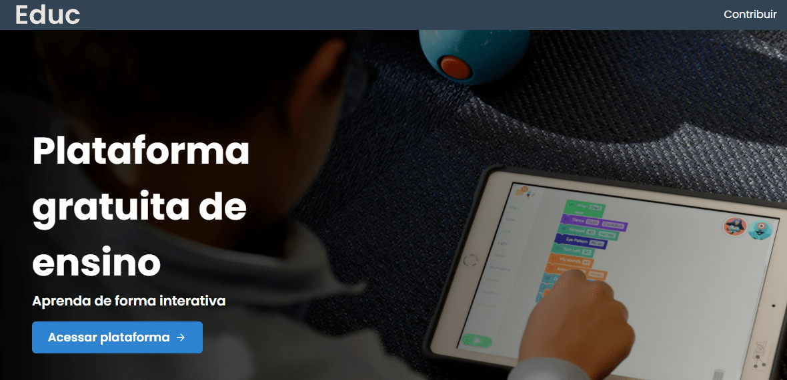

# Educ.io

> Projeto desenvolvido durante a participação do DoWhile2021 da Rocketseat

  

O projeto foi desenvolvido com a seguinte proposta feita pela Rocketseat: "como você solucionaria os problemas de acesso à educação hoje, utilizando a tecnologia?"

A Educ é uma plataforma gratuita de ensino que tem foco em dar uma base sólida para seus estudantes. É possível obter o certificado de ensino fundamental, desenvolver habilidades de ilustração, design, programação, produção de conteúdo, mercado financeiro e música e até mesmo indicar alguém que não saiba ler a aprender na plataforma.

O objetivo é disponibilizar um ensino personalizado de acordo com os objetivos do aluno, o aprendizado é feito com material de apoio (material para leitura, vídeos e exercícios), fórum de dúvidas (comunidade de alunos e professores) e de forma interativa.

## Chakra UI e NextJs

Este foi meu primeiro projeto usando o Chakra UI, uma biblioteca React para construir interfaces. Como o NextJs é um framework construído em cima do React, é possível integrar o Chakra com o Next também. Além disso, parte da estilização foi feita com o sass, utilizando o conceito de css modules.

A escolha do NextJs é porque ele é mais indicado para otimizar a indexação da página no google e outros motores de busca.

## Responsividade

Responsividade é essencial em um projeto que propõe acesso à educação, dessa forma a aplicação se adapta ao viewport do dispositivo.

## Live Demo

https://educ-beryl.vercel.app/
